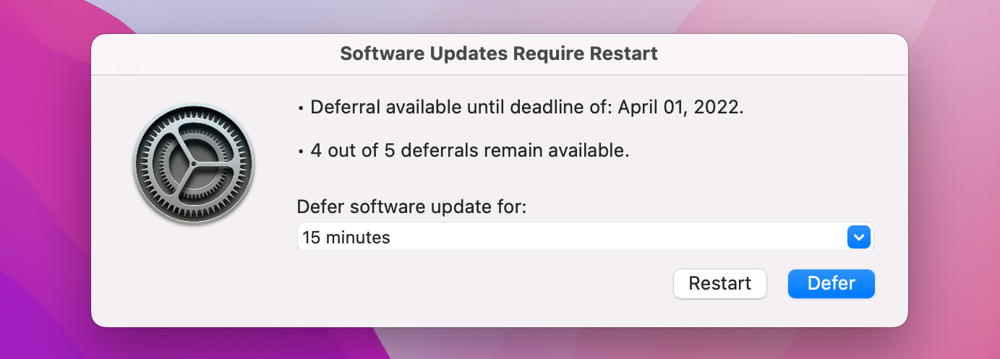
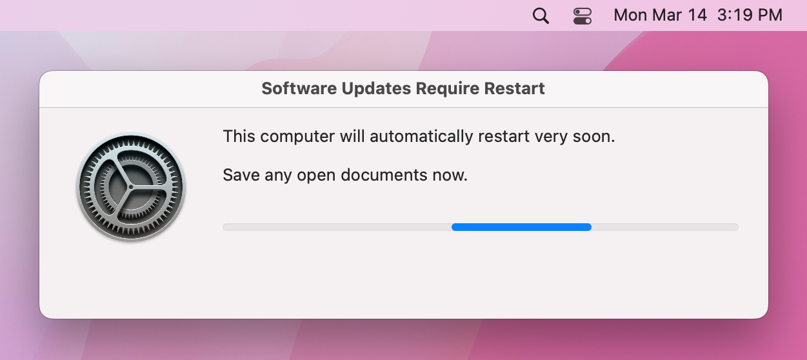

## S.U.P.E.R.M.A.N.
### Software Update Policy Enforcement (with) Recursive Messaging And Notification

S.U.P.E.R.M.A.N. optimizes the macOS software update experience.

by Kevin M. White

### Features and Options

- Fully automatic macOS software update workflow for both Intel and Apple Silicon computers.
- Automatic dialogs and notifications via [IBM Notifier](https://github.com/IBM/mac-ibm-notifications).
- Minimized downtime by automatically downloading and preparing updates before interrupting the user.
- Automatic deferral option for Focus, Do Not Disturb, and screen sleep assertions (presentations, meetings, etc).
- Update enforcement options including hard deadline, soft deadline, and maximum deferral count deadline.
- Background agent (LaunchDaemon) works independently of management (MDM) service.
- Automatic installation of all required items and dependencies.
- Configurable via command line or MDM managed preference.
- Absurd levels of validation and logging including both test mode and verbose mode.
- For computers managed via Jamf Pro, automatic inventory and policy update as soon as possible after computer restarts.
- For computers managed via Jamf Pro, option to run pre-update policies.
- For computers managed via Jamf Pro, option to enforce policies and restart without macOS software updates.

### Screenshots

__Update dialog with multiple deadlines and pop-up deferral choice__

__Restart notification__

### Requirements

__Mac computers with Intel:__

- Validated on macOS 10.14 and later. Earlier versions of macOS may work, but have not been validated.

__Mac computers with Apple Silicon:__

Mac computers with Apple Silicon require additional authorization (beyond root privileges) to update automatically without user interaction.
__Without this additional authorization, S.U.P.E.R.M.A.N. can not enforce macOS software updates on Apple Silicon!__
This authorization is possible via three methods:
- An existing local account
- An automatically created local service account
- A Jamf Pro API account

### Apple Silicon Authorization Requirement Details

Apple Silicon `softwareupdate` via an __existing local account:__
- Any version of macOS for Apple Silicon (macOS 11.0 or later).
- You must provide credentials for an existing local (standard or admin) user account who already has volume ownership permissions. User accounts created during Setup Assistant that have logged in at least once have volume ownership permissions. For more information see the [Apple Platform Deployment](https://support.apple.com/guide/deployment/use-secure-and-bootstrap-tokens-dep24dbdcf9e) guide.
- The provided credentials are used to authenticate the `softwareupdate` command.
- The provided credentials are stored in the System Keychain and can be viewed by other admin users.

Apple Silicon `softwareupdate` via an __automatically created local service account:__
- Any version of macOS for Apple Silicon (macOS 11.0 or later).
- You must provide credentials for an existing local admin user account who already has volume ownership permissions.  User accounts created during Setup Assistant that have logged in at least once have volume ownership permissions. For more information see the [Apple Platform Deployment](https://support.apple.com/guide/deployment/use-secure-and-bootstrap-tokens-dep24dbdcf9e) guide.
- The provided admin credentials are used to automatically generate a new local service account. This service account provides authentication for the `softwareupdate` command.
- The creation of the service account triggers a system security dialog unless you also deploy a PPPC Configuration Profile granting "SystemPolicySysAdminFiles" to either `com.apple.Terminal` or `/usr/local/jamf/bin/jamf` and `com.jamf.management.Jamf`.
- The admin credentials you provide are never saved to disk, but the local service account credentials are stored in the System Keychain and can be viewed by other admin users.
- The local service account is not an admin and can not log into the Mac, but if FileVault is enabled, this account is visible at startup and can unlock the drive.

Apple Silicon MDM update command via __Jamf Pro API:__
 - macOS 11.5 or later and Jamf Pro 10.35 or later.
 - Jamf Pro must have the bootstrap token escrowed for the computer. This is the default behavior for Jamf Pro via any enrollment method for Apple Silicon computers.
 - You must provide credentials that can authorize macOS software update MDM commands via the Jamf Pro API.
 - The Jamf Pro API credentials you provide are stored in the System Keychain and can be viewed by other admin users.
 - The default Jamf Pro privileges required for this account are "Jamf Pro Server Objects > Computers > Create & Read" and "Jamf Pro Server Actions > Send Computer Remote Command to Download and Install macOS Update".
 - You can significantly reduce the security risk of this account by removing the "Computers > Read" privilege requirement. However, this requires deploying a custom Configuration Profile for the preference domain `com.macjutsu.super` containing the following: `<key>JamfProID</key> <string>$JSSID</string>`

_If multiple valid authorization methods are provided, the priority order is as follows: an existing local account, the local service account, and finally the Jamf Pro API credentials._

### Installation

__To install and run locally:__
1. Make sure the S.U.P.E.R.M.A.N. script (named just `super`) has appropriate execute permissions and then run it like any other local management script: `sudo /wherever/the/heck/you/downloaded/super --help`
2. The super script automatically installs itself (and various other accoutrements) anytime it's ran from outside its working folder, which is defaulted to /Library/Management/super.
3. There's no step three. After self-installation, super automatically restarts itself with your previously specified options and, if necessary, creates a LaunchDaemon to keep things going.

__To deploy via Jamf Pro:__
1. Create a new Policy adding just the super script as-is.
2. Add to the Policy a configuration for: Files and Processes > Execute Command > `/Library/Management/super/super --bunch-of-options --go-here`
3. There's "basically" no step three (besides running the Policy). The super script automatically installs itself then restarts via LaunchDaemon, thus freeing the jamf agent to get on with other things.

### General Usage

Wiki coming soon! Until then use: `sudo super --help`
